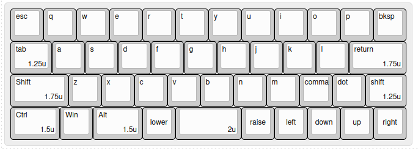
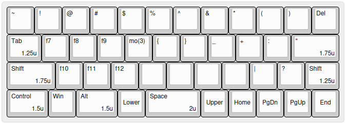
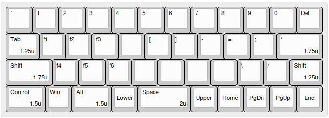
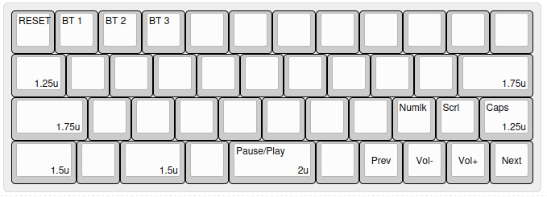

# Write 40 v3.1

A compact bluetooth enabled keyboard based on Write 40 v3.1 pcb
With staggered layout alphas and Planck40 inspired bottom row

## Keymap

Current key binding, Ascii illustration also available in `.keybind` file

**Base Layer**

**Layer 1 (Lower)**

**Layer 2 (Upper)**

**Layer 3 (System)**

## Where is the keyboard?

I don't release it
